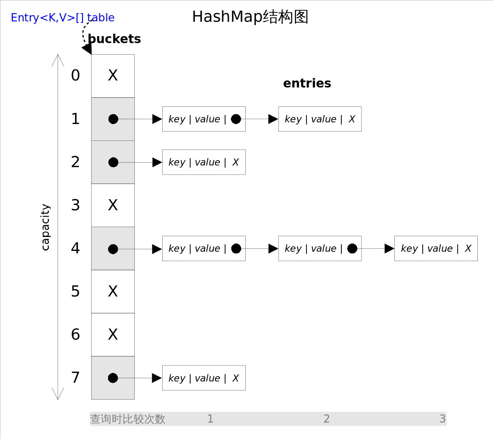

# Java容器 - Map

## HashMap

`HashMap`中实现了一个内部类`HashMap`，代码如下：

```Java
static class Node<K,V> implements Map.Entry<K,V> {
    final int hash;
    final K key;
    V value;
    Node<K,V> next;

    Node(int hash, K key, V value, Node<K,V> next) {
        this.hash = hash;
        this.key = key;
        this.value = value;
        this.next = next;
    }

    public final K getKey()        { return key; }
    public final V getValue()      { return value; }
    public final String toString() { return key + "=" + value; }

    public final int hashCode() {
        return Objects.hashCode(key) ^ Objects.hashCode(value);
    }

    public final V setValue(V newValue) {
        V oldValue = value;
        value = newValue;
        return oldValue;
    }

    public final boolean equals(Object o) {
        if (o == this)
            return true;
        if (o instanceof Map.Entry) {
            Map.Entry<?,?> e = (Map.Entry<?,?>)o;
            if (Objects.equals(key, e.getKey()) &&
                Objects.equals(value, e.getValue()))
                return true;
        }
        return false;
    }
}
```

`HashMap`采用的是**冲突链表方式**。



`HashMap`有几个重要的属性：

```Java
transient Node<K,V>[] table;
transient Set<Map.Entry<K,V>> entrySet;
transient int size;
final float loadFactor;
int initialCapacity;
```
* table 第一次使用的时候进行初始化，长度必定是2的倍数。上图中左侧的数字就是table。

* entrySet

* size 键值对的数量

* initialCapacity & loadFactor 初始容量和负载因子，这两个参数会决定`HashMap`的性能。初始容量指定了初始`table`的大小，负载系数用来指定自动扩容的临界值。当`entry`的数量超过`initialCapacity * loadFactor`时，容器将自动扩容并重新哈希。对于插入元素较多的场景，将初始容量设大可以减少重新哈希的次数。

### 方法剖析

* 构造函数

  ```Java
  public HashMap(int initialCapacity, float loadFactor) {
      if (initialCapacity < 0)
          throw new IllegalArgumentException("Illegal initial capacity: " +
                                             initialCapacity);
      if (initialCapacity > MAXIMUM_CAPACITY)
          initialCapacity = MAXIMUM_CAPACITY;
      if (loadFactor <= 0 || Float.isNaN(loadFactor))
          throw new IllegalArgumentException("Illegal load factor: " +
                                             loadFactor);
      this.loadFactor = loadFactor;
      this.threshold = tableSizeFor(initialCapacity);
  }

  //根据输入的容量计算一个最接近的2的倍数
  static final int tableSizeFor(int cap) {
      int n = cap - 1;
      n |= n >>> 1;
      n |= n >>> 2;
      n |= n >>> 4;
      n |= n >>> 8;
      n |= n >>> 16;
      return (n < 0) ? 1 : (n >= MAXIMUM_CAPACITY) ? MAXIMUM_CAPACITY : n + 1;
  }
  ```

* `get(Object):V`
  ```Java
  public V get(Object key) {
    Node<K,V> e;
    return (e = getNode(hash(key), key)) == null ? null : e.value;
  }

  static final int hash(Object key) {
      int h;
      return (key == null) ? 0 : (h = key.hashCode()) ^ (h >>> 16);
  }

  final Node<K,V> getNode(int hash, Object key) {
    Node<K,V>[] tab;
    Node<K,V> first, e;
    int n;
    K k;
    if ((tab = table) != null && (n = tab.length) > 0 &&
        (first = tab[(n - 1) & hash]) != null) {
        if (first.hash == hash && // 先检查冲突链的第一个结点
            ((k = first.key) == key || (key != null && key.equals(k))))
            return first;
        if ((e = first.next) != null) {
            if (first instanceof TreeNode)
                return ((TreeNode<K,V>)first).getTreeNode(hash, key);
            do {
                if (e.hash == hash &&
                    ((k = e.key) == key || (key != null && key.equals(k))))
                    return e;
            } while ((e = e.next) != null);
        }
    }
    return null;
  }
  ```

  首先通过`hash(key)`获取到key对应的Hash值，然后通过`(n - 1) & hash`计算出在`table`中的下标。然后依次遍历冲突链，通过`key.equals(k)`方法来判断是否是要找的那个entry。

  * `put(K,V):V`

  ```Java
  public V put(K key, V value) {
      return putVal(hash(key), key, value, false, true);
  }  

  final V putVal(int hash, K key, V value, boolean onlyIfAbsent,
                 boolean evict) {
      Node<K,V>[] tab; Node<K,V> p; int n, i;
      if ((tab = table) == null || (n = tab.length) == 0)
          n = (tab = resize()).length;
      if ((p = tab[i = (n - 1) & hash]) == null)
          tab[i] = newNode(hash, key, value, null);
      else {
          Node<K,V> e; K k;
          if (p.hash == hash &&
              ((k = p.key) == key || (key != null && key.equals(k))))
              e = p;
          else if (p instanceof TreeNode)
              e = ((TreeNode<K,V>)p).putTreeVal(this, tab, hash, key, value);
          else {
              for (int binCount = 0; ; ++binCount) {
                  if ((e = p.next) == null) {
                      p.next = newNode(hash, key, value, null);
                      if (binCount >= TREEIFY_THRESHOLD - 1) // -1 for 1st
                          treeifyBin(tab, hash);
                      break;
                  }
                  if (e.hash == hash &&
                      ((k = e.key) == key || (key != null && key.equals(k))))
                      break;
                  p = e;
              }
          }
          if (e != null) { // existing mapping for key
              V oldValue = e.value;
              if (!onlyIfAbsent || oldValue == null)
                  e.value = value;
              afterNodeAccess(e);
              return oldValue;
          }
      }
      ++modCount;
      if (++size > threshold)
          resize();
      afterNodeInsertion(evict);
      return null;
  }  
  ```

  该方法首先会对`map`做一次查找，看是否包含该元组，如果已经包含则直接返回，查找过类似于`getEntry()`方法；如果没有找到，则会使用头插法进行插入。

## LinkedHashMap

## TreeMap
